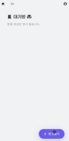
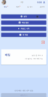
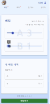
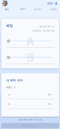

# 🕹️ 온오프라인 통합 게임 플랫폼

[](https://your-railway-url.com)  

> **온·오프라인**의 경계를 허물다!  
> 사람들이 한자리에 모여 함께 대화하고, 협력하며 즐기는 온오프라인 통합 게임 플랫폼. 
> 웹에서는 게임 로직을 지원하여 진행을 도와줍니다.

## 🌟 프로젝트 소개

이 프로젝트는 **Next.js**와 **Socket.IO**를 사용하여 온오프라인 상호작용을 지원하는 게임 플랫폼입니다. 플레이어들이 실제로 모여 대화하며 진행되는 게임으로, 웹 애플리케이션은 게임의 흐름을 돕는 역할을 합니다.

### 주요 기능
- **실시간 통신**: Socket.IO를 활용한 실시간 이벤트 관리 및 통신.
- **게임 상태 관리**: 사용자별 상태 저장 및 실시간 동기화.
- **게임 소개 페이지**: 유저들에게 게임 규칙과 진행 방법을 안내하는 전용 페이지.

[🌐 게임 소개 페이지를 미리 확인해보세요!](https://gameweb-production.up.railway.app/games/horse)

## 🎮 게임 방식

- **오프라인 대면 플레이**: 플레이어들은 직접 대면하여 대화하며 게임을 진행합니다.
- **웹 애플리케이션**: 웹에서는 게임 로직을 자동으로 처리하여 진행을 돕습니다.
  
  - 각 플레이어의 상태를 실시간으로 반영하여 게임을 매끄럽게 진행.
  - 게임 내 주요 이벤트 및 점수 집계는 모두 서버에서 처리.

### 게임 흐름 예시

1. host가 게임 방을 만들고, 몇몇 설정을 진행합니다.
2. 플레이어들은 웹사이트에 접속해 해당 게임방에 접속하여 필요한 역할이나 개별 토큰을 할당받습니다.
3. 오프라인과 병행하기에 현장조율이 필요합니다. 때문에 각 라운드의 시작은 host의 '라운드 시작'버튼으로 결정되며 실시간 피드백을 반영하여 라운드의 시간을 설정합니다.
4. 오프라인에서 대화를 통해 게임을 진행하며, 웹 애플리케이션은 실시간으로 정보를 처리해 결과를 도출합니다.
5. 승자가 결정되면, 웹에서 자동으로 알림을 제공합니다.

| 1.방만들기 | 1.호스트 설정 | 4.플레이 영상 | 5.승리 |
| ------ | ------ | ------ | ------ |
|  |  |  |  |

## ⚙️ 기술 스택

- **프론트엔드**: Next.js
- **백엔드**: Next.js
- **실시간 통신**: Socket.IO
- **배포**: [Railway](https://railway.app) 플랫폼
- **DB**: 데이터베이스 없이 실시간 통신과 상태 저장을 서버 메모리로 관리

```bash
# 주요 라이브러리 설치
npm install next socket.io
```

## 📦 설치 및 실행

로컬에서 프로젝트를 실행해보고 싶으신 분들을 위해 설치 및 실행 방법을 안내드립니다.

1. **레포지토리 클론**:
   
   프로젝트를 클론하여 로컬 환경에 복사합니다.
   ```bash
   git clone https://github.com/xotjrOh/gameWeb.git
   cd gameWeb
   ```
2. **의존성 설치**:
   
   Next.js와 Socket.IO 등 필요한 라이브러리를 설치합니다.
   ```bash
   npm install
   ```
3. **환경변수 파일 생성**:
   
   .env.local 파일을 package.json과 같은 경로에 생성 및 다음의 값들을 등록
   ```bash
   # '카카오 개발자도구'에 접속하여 oauth를 위한 id와 secret값 등록
   KAKAO_CLIENT_ID=your-kakao-client-id
   KAKAO_CLIENT_SECRET=your-kakao-client-secret
   # '구글 개발자도구'에 접속하여 oauth를 위한 id와 secret값 등록
   GOOGLE_CLIENT_ID=your-google-client-id
   GOOGLE_CLIENT_SECRET=your-google-client-secret

   NEXTAUTH_SECRET=your-generated-random-string
   NEXTAUTH_URL=http://localhost:3000

   NEXT_PUBLIC_SITE_URL=http://localhost:3000
   ```
4. **Pre-commit Hook 설정**:
   
   git으로 관리할 경우 .git/hooks/pre-commit 파일 생성.
   version관리를 통한 새로고침을 유도하기 위함(잘못된 socket에 등록된 이벤트 제거를 위함)
   ```bash
   #!/bin/sh

   # package.json의 버전 업데이트
   echo "Updating package.json version..."
   npm version patch --no-git-tag-version

   # 변경된 package.json과 package-lock.json을 스테이징
   git add package.json package-lock.json
   ```
5. **로컬 서버 실행**:
   
   아래 명령어로 개발 서버를 실행하고, 웹 브라우저에서 http://localhost:3000 으로 접속합니다.
   ```bash
   npm run dev
   ```
**배포된 버전 접속**:
로컬에서 실행하지 않고 바로 플레이하려면 아래 링크를 클릭하세요: https://gameweb-production.up.railway.app/

## 📄 라이선스

이 프로젝트는 [MIT 라이선스](LICENSE)를 따릅니다.

## 🚀 향후 계획

- **새로운 게임 모드 추가**
- **TS로 마이그레이션**