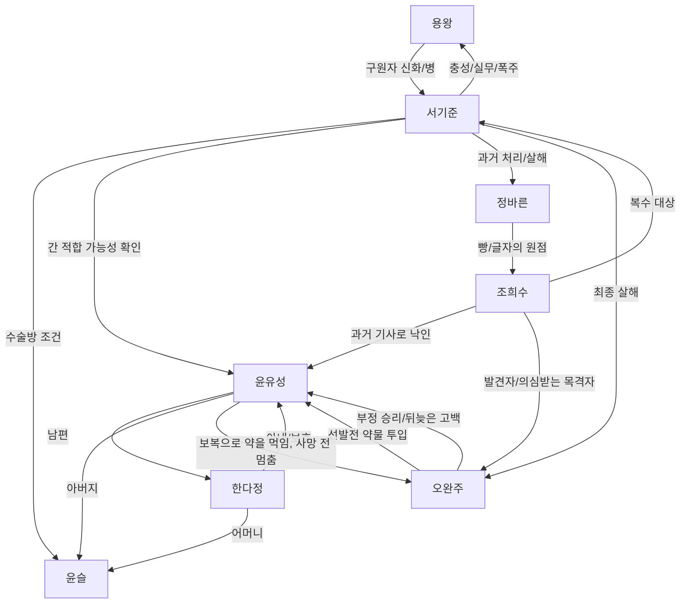

# Rabbit Turtle Story Context

이 문서는 `rabbit-turtle-finish-line-night` 시나리오를 고치거나 조언할 때 먼저 읽는 고정 컨텍스트다.
문서보다 현재 소스가 우선이지만, 토끼와 거북이 관련 답변은 이 문서의 관계와 사건 축을 깨지 않는 선에서 해야 한다.

## Source Of Truth

- 시나리오 본문: `data/murder-mystery/scenarios/rabbit-turtle-finish-line-night.yaml`
- 윤유성 룰지: `data/murder-mystery/rulesheets/rabbit-turtle-finish-line-night/rabbit_husband.txt`
- 조희수 룰지: `data/murder-mystery/rulesheets/rabbit-turtle-finish-line-night/fox.txt`
- 서기준 룰지: `data/murder-mystery/rulesheets/rabbit-turtle-finish-line-night/jara.txt`
- 한다정 참고 룰지: `data/murder-mystery/rulesheets/rabbit-turtle-finish-line-night/wife_npc_reference.txt`
- 엔딩/해설 작법: `data/murder-mystery/WRITING_REFERENCE_ENDING_RABBIT_TURTLE.md`

## Fixed Truths

- 최종적으로 오완주를 죽인 범인은 서기준이다.
- 윤유성은 오완주에게 수면유도제를 먹였지만, 별똥별과 윤슬의 기억 앞에서 멈췄다. 오완주는 그때 아직 살아 있었다.
- 한다정은 쓰러진 오완주와 윤유성 보온병의 고무링을 봤고, 남편을 지키려 고무링을 숨겼다.
- 조희수는 오완주를 죽이러 온 것이 아니다. 정바른의 죽음과 서기준의 관련성을 확인한 뒤, 서기준을 찌르려고 진정제와 주사기를 훔쳤다.
- 서기준은 윤유성을 의료동에 묶어 용왕에게 필요한 간 일부를 얻으려 했다.
- 서기준은 살아 있는 오완주를 발견한 뒤, 윤유성을 붙잡을 살인 사건이 필요하다고 판단해 오완주를 익사시켰다.
- 용왕이 직접 명령한 것으로 확정하지 않는다. 현재 진상은 서기준이 용왕을 살리는 임무로 받아들여 폭주한 구조다.
- 사건 시간에 강당을 벗어난 인물은 윤유성, 한다정, 조희수, 서기준 네 명이다. 외부 의료진/스태프 목격자를 새 용의자로 늘리면 구조가 깨진다.
- 오완주는 재활이 필요한 환자가 아니다. 재활수조실은 사건 장소이지, 오완주의 치료 루틴 장소가 아니다.
- 시체는 젖어 있지 않다. 젖은 시체, 젖은 옷, 물에 담긴 채 발견 같은 묘사는 쓰지 않는다.
- 오완주에게 뚜렷한 주사 자국은 없다. 주사기는 조희수의 살해도구처럼 보이는 붉은 청어지만 실제 목표는 서기준이다.

## Relationship Map

## Past Timeline

1. 정바른은 굶주린 조희수에게 빵을 나눠 준 친구다.
2. 정바른은 시장 신문 기사에서 `떠돌이`, `소란`, `위협` 같은 낙인을 받았고, 그 글자가 생존 공간을 빼앗았다.
3. 조희수는 정바른을 죽인 것이 무엇인지 알기 위해 글자를 배웠고, 훗날 기자가 됐다.
4. 서기준은 보호동 시절 정바른을 알았고, 나중에 용왕의 일을 수행하며 정바른을 처리했다.
5. 서기준은 정바른의 목맨 현장 폴라로이드를 보관했고, 뒷면에 `완료`를 남겼다.
6. 윤슬은 수술이 필요한 아이였고, 용왕재단의 긴급 배정 없이는 순번이 늦었다.
7. 서기준은 윤유성이 국가대표 선발전에서 우승하면 윤슬에게 수술방을 돌리겠다고 했다.
8. 오완주는 윤유성에 대한 열등감과 기사 프레임에 휘둘려 선발전 직전 윤유성의 물병에 수면유도제를 넣었다.
9. 윤유성은 경기 중 잠에 끌려 들어갔고, 팔을 깨물며 버티다 무너졌다.
10. 조희수는 `재능만 믿던 스타의 몰락`이라는 기사를 썼고, 윤유성의 몰락 프레임에 가담했다.
11. 재단은 후원을 보류했고, 공개 사과 방송을 조건으로 다시 수술 기회를 내밀었다.
12. 공개 사과 방송 중 윤슬의 상태가 악화됐고, 윤유성의 휴대전화는 보관함에 있었다. 윤슬은 윤유성이 도착하기 전에 죽었다.
13. 윤슬 사망 뒤 서기준은 윤슬 대신 윤유성의 건강기록을 용왕의 간 적합 가능성과 연결했다.
14. 후원선수 복귀 기자간담회는 윤유성을 용궁섬과 의료동으로 유도하기 위한 장치다.

## Event Timeline

1. 본행사 전 조희수는 의료동 간이책상에서 서기준의 숨겨진 자료를 본다.
2. 조희수는 정바른 사진, `완료`, 보고서의 서기준 이름을 확인하고, 진정제와 주사기를 훔친다.
3. 오완주는 윤유성에게 선발전 약물 투입을 고백하려고 서류봉투를 들고 강당 아래쪽 이중문 밖으로 나간다.
4. 윤유성은 오완주를 따라 재활수조실로 간다.
5. 오완주는 물병에 수면유도제를 탔다고 고백하고, 봉투 안에는 자필 고백문과 처방전 사본이 있다고 말한다.
6. 윤유성은 자기 수면유도제를 보온병에 타 오완주에게 마시게 하고, 3분을 버티라고 한다.
7. 오완주는 2분 24초쯤 쓰러진다. 윤유성은 죽이려다가 멈추고, 서류봉투와 보온병을 들고 떠난다.
8. 한다정은 남편을 찾다가 재활수조실에서 쓰러진 오완주와 하얀 고무링을 본다.
9. 한다정은 윤유성 보온병의 고무링이라고 알아보고 숨긴다. 구두 소리를 듣고 비품 정리실로 피한다.
10. 조희수는 서기준을 따라가려 세탁실과 비품 정리실로 들어오고, 한다정과 마주친다.
11. 서기준은 비품 정리실을 지나 재활수조실로 들어간다.
12. 조희수는 비품 뒤에서 진정제를 채운 주사기를 들고 기다리지만, 서기준은 비품 정리실로 들어오지 않는다.
13. 서기준은 살아 있는 오완주를 확인한다. 윤유성과 봉투가 사라진 상황에서 윤유성을 붙잡을 명분이 필요해진다.
14. 서기준은 어린이용 수조의 얕은 물, 고무호스, 성인용 수조 안에 낮게 둔 파란 수거통, 사이펀 원리를 이용해 물을 모은다.
15. 서기준은 오완주의 머리를 물이 담긴 파란 수거통에 눌러 익사시킨다.
16. 서기준은 물기를 닦고, 수거통과 수건과 호스를 원래처럼 돌려놓고, 자세를 비슷하게 맞춘다.
17. 젖은 구두 자국은 남지만 시간이 지나면 흐려질 수 있다.
18. 서기준이 ㄱ자로 꺾인 복도 안쪽으로 막 들어서려던 순간, 조희수가 재활수조실에 들어가 오완주를 발견하고 비명을 지른다.
19. 서기준은 직원과 의사들을 이용해 재활수조실 진입을 늦추고, 밖의 소지품과 동선 조사부터 시킨다.
20. 비명 직후 서기준은 의료동으로 의사들을 부르러 가는 동안 환자 신발과 병원 슬리퍼가 섞인 의료동 입구 신발장에 젖은 구두를 숨기고, 신발장에 있던 운동화로 갈아 신는다.

## Investigation Structure

- 1라운드 전: 의사들이 재활수조실 안에서 오완주의 상태를 확인하므로 네 사람은 밖의 소지품과 의료동/복도 정황을 먼저 본다.
- 1라운드 주요 축:
  - 윤유성의 보온병과 오완주 봉투
  - 한다정의 고무링과 가족사진
  - 조희수의 주사기와 빈 진정제 병
  - 서기준의 행사 진행표와 의료동 일정 메모
  - 의료동 간이책상: 정바른 폴라로이드, 건강기록 비교
  - 의료동 소문과 신발장
- 2라운드 전: 오완주의 사망이 확정되고, 재활수조실 안쪽 조사가 열린다.
- 2라운드 주요 축:
  - 사체 상태
  - 어린이용 수조 3cm 물
  - 비어 있던 성인용 수조
  - 고무호스와 사이펀 안내문
  - 파란 수거통과 젖은 수건
  - 통유리 긁힘
  - 젖은 구두 자국

## Clue Meanings

- 보온병의 흰 가루/쓴 냄새/빠진 고무패킹: 윤유성이 오완주에게 약을 먹였고, 한다정이 고무링을 숨겼다는 축.
- 오완주의 자필 고백문/처방전/오완주기금: 선발전 약물 투입, 뒤늦은 사죄, 기금 분기 선택의 축.
- 조희수의 주사기/빈 진정제 병/피: 조희수가 약물을 준비했다는 사실. 실제 목표는 서기준이다.
- 의료동 간이책상 폴라로이드: 정바른 사망과 서기준의 연결. 조희수의 복수 동기.
- 건강기록 비교 발췌: 윤슬의 가능성이 윤유성으로 옮겨졌고, 서기준의 의료동 계획이 윤유성을 향했다는 축.
- 의료동 일정/회복 음료 메모: 행사 후 윤유성을 의료동으로 유도하려던 계획.
- 사이펀 안내문, 고무호스, 파란 수거통, 수조 높이: 오완주의 직접 사망 방식.
- 젖은 구두 자국, 신발장 젖은 구두, 사라진 환자 운동화: 서기준이 물을 다루며 현장에 있었고, 환자 신발과 병원 슬리퍼가 섞인 곳에 구두를 숨긴 뒤 운동화로 갈아 신었다는 물증.
- 한다정 잠금 증언: 조희수가 비품 정리실에서 품 안에 손을 넣고 재활수조실 쪽을 보고 있었다는 의심 증언. 조희수를 먼저 의심해야 공개되는 특수 카드다.

## Suspect Axes

### 윤유성

- 강한 동기: 윤슬의 죽음, 선발전 약물 고백, 오완주에 대한 분노.
- 강한 물증: 보온병의 약 흔적, 오완주 봉투 소지, 고무패킹.
- 한계: 직접 사망 전 멈췄고, 오완주는 살아 있었다.
- 작성 기준: 윤유성은 깨끗한 피해자가 아니라 복수 직전까지 간 인물이다. 그러나 최종 살인자는 아니다.

### 조희수

- 강한 의심: 진정제와 주사기, 비품 정리실 잠복, 발견자 위치, 한다정과의 상호 은폐.
- 실제 동기: 정바른을 처리한 서기준에 대한 복수.
- 오완주와의 기존 연결: 과거 윤유성 몰락 기사에 가담했고, 오완주는 그 기사 속에서 정당한 승자처럼 소비됐다.
- 한계: 조희수는 오완주가 고백할 사실을 알지 못한다. 오완주를 죽일 강한 직접 동기는 현재 없다.
- 조희수를 오완주 살해 용의자로 보강할 때는 살해수단보다 `기사/글자/오완주의 승자 서사`를 동기로 쓰는 편이 기존 룰지와 맞다.
- 주사기를 오완주 살해 도구로 확정하지 않는다. 조희수가 서기준을 노렸다는 진실을 보존해야 한다.

### 한다정

- 강한 의심: 고무링 은닉, 쓰러진 오완주를 보고도 즉시 신고하지 않음, 조희수와 마주친 일을 숨김.
- 실제 행동: 남편을 보호하려 고무링을 숨기고 도망쳤다.
- 한계: 오완주를 죽인 직접 행동은 없다. 너무 많은 목격 지식을 주면 진상 구조가 깨진다.

### 서기준

- 진범: 오완주를 익사시켰다.
- 동기: 윤유성을 섬과 의료동에 붙잡을 명분이 필요했다.
- 더 큰 목적: 용왕에게 필요한 간 적합 가능성 때문에 윤유성을 의료동으로 유도하려 했다.
- 위험 단서: 건강기록 비교, 의료동 일정, 사이펀/수조/수거통, 젖은 구두 자국, 신발장 젖은 구두, 사라진 환자 운동화, 정바른 폴라로이드.

### 범인 없음

- 오답 근거: 약을 마시고 쓰러진 오완주, 뚜렷한 외상 없는 사체, 단수 상태의 재활수조실.
- 한계: 사이펀/수거통/구두 흔적을 설명하지 못한다.

## Jo Heesu Writing Guardrails

- 조희수의 핵심은 `글자`, `기사`, `이름`, `낙인`, `정바른`이다.
- 조희수는 서기준을 향한 분노 때문에 살의까지 갔지만, 오완주에게 같은 수준의 직접 살의가 확정되어 있지 않다.
- 조희수를 더 의심스럽게 만들고 싶다면 다음 축을 우선 검토한다.
  - 과거 윤유성 몰락 기사와 오완주의 승자 이미지가 조희수에게 죄책감/분노로 남아 있다는 취재 메모.
  - 조희수가 발견자이면서도 모든 사실을 말하지 못하는 침묵.
  - 비품 정리실 체류, 재활수조실 입장, 비명 전 공백처럼 행동 순서가 애매하게 보이는 정황.
  - 한다정과 조희수가 서로 숨길 것이 있다는 상호 은폐.
- 피해야 할 보강:
  - 오완주 재활 기록, 오완주의 치료 루틴처럼 현재 없는 설정.
  - 외부 의료진/스태프가 결정적 목격자가 되는 새 구조.
  - 조희수가 오완주의 고백문을 알고 있었다는 전제. 새 단서를 넣기 전에는 성립하지 않는다.
  - 주사기로 등껍질을 뚫었다거나, 주사 자국이 반드시 안 남는다는 식의 무리한 병리/동물 설정.
  - 시체가 젖었다는 단서.

## Ending Structure

- 오답 엔딩은 지목 대상별 도입부와 공통 실패 결말로 구성되어 있다.
- 정답 지목 뒤에는 조희수의 기사 선택과 윤유성의 고백문 선택이 열린다.
- 조희수 선택:
  - `서기준의 이름에서 멈춘다`: 복수의 연쇄를 끊고 정확히 확인된 범인에게 제목을 둔다.
  - `용왕의 이름까지 기사에 올린다`: 서기준이 지키려던 이름을 무너뜨리는 복수다. 용왕 직접 지시는 확정하지 않는다.
- 윤유성 선택:
  - `고백문을 공개한다`: 오완주의 부정 승리를 바로잡고 윤유성의 이름을 회복하지만, 오완주기금은 집행되지 못한다.
  - `고백문을 접어 둔다`: 오완주기금은 아이들에게 쓰이지만, 윤유성은 계속 잘못된 동화와 기록을 감당한다.
- 공통 진상은 `사실이라고 해서 진실은 아니다`로 닫힌다. 개별 사실을 모아도 목적지와 최종 행위자를 보아야 한다.

## Answer Checklist

토끼와 거북이 질문에 답하기 전 확인한다.

1. 내가 제안하는 단서가 현재 룰지의 인물 동선과 충돌하지 않는가?
2. 오완주를 재활 환자로 만들거나 시체를 젖게 만들고 있지 않은가?
3. 조희수의 실제 목표가 서기준이라는 축을 깨지 않는가?
4. 오완주 고백문을 조희수가 알았다는 전제를 새로 만들고 있지 않은가?
5. 외부 목격자나 새 용의자를 넣어 네 명 구조를 깨지 않는가?
6. 서기준이 진범이라는 물리 트릭과 의료동 계획이 그대로 유지되는가?
7. 단서는 `보이는 사실`과 `플레이어의 오해 가능성`을 분리하고 있는가?
8. 새 제안이 단서인지, 룰지 수정인지, 엔딩 수정인지 범위를 분명히 말했는가?
